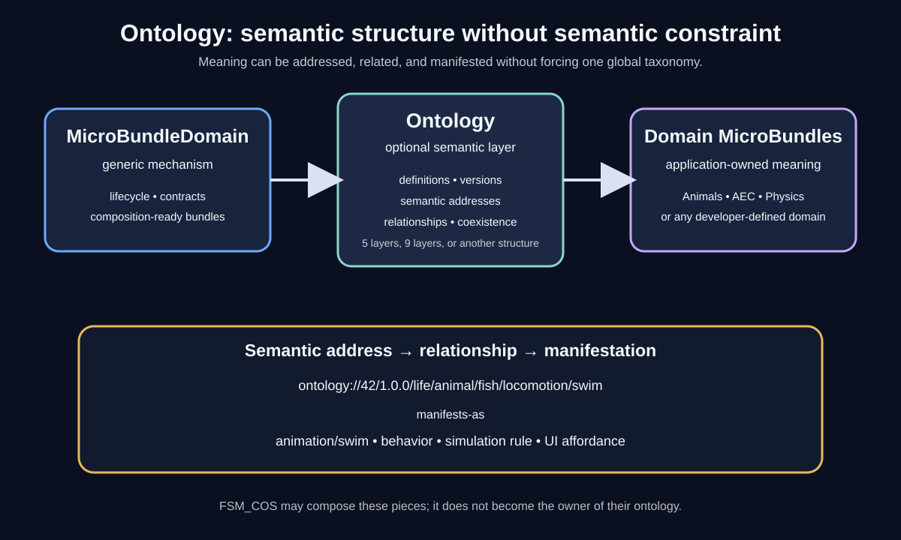

# Ontology Architecture



The package sits above the generic MicroBundle mechanism and beside application/domain content. It does not become the authority for every MicroBundle.

## Boundary map

```text
MicroBundleDomain
       |
       +---- Ontology ---- semantic definitions
       |
       +---- Domain MicroBundles ---- application meaning

FSM_COS composes the resulting pieces without owning their ontology.
```

| Concern | Owner | Ontology dependency |
|---|---|---|
| MicroBundle lifecycle and contracts | MicroBundleDomain | None |
| Semantic definitions and addresses | Ontology | MicroBundleDomain is allowed |
| Physical storage and retrieval | MicroBundleRepository | None required |
| Runtime composition | FSM_COS | May compose ontology bundles |
| Domain meaning | Application/domain MicroBundles | Optional |
| Manifestation | Renderer/UI/simulation packages | Optional semantic resolution |

## Semantic resolution flow

```text
                 EXPERIENCE / APPLICATION
                           |
                           v
                    semantic request
                           |
                           v
                    OntologyAddress
                           |
                 +---------+---------+
                 |                   |
                 v                   v
          ontology relationship   repository
                 |                   |
                 v                   v
          meaning / mapping       artifact
                 |                   |
                 +---------+---------+
                           |
                           v
                      manifestation
                 (behavior / UI / render)
```

The important boundary is that the semantic address does not itself contain the implementation. It identifies meaning. A relationship can connect that meaning to an implementation owned elsewhere.


## Domain contract inventory

The current package deliberately separates five kinds of semantic information:

| Contract | Answers | Does not answer |
|---|---|---|
| `OntologyDefinition` | Which ontology is this, which version is it, and what ordered layers does it declare? | What individual concepts mean |
| `OntologyAddress` | Where is a semantic concept located within a qualified ontology? | How that concept is implemented |
| `OntologyIndex` | What compact scalar or N-dimensional coordinate identifies the location? | How coordinates are stored physically |
| `OntologyIndexSpace` | What bounded coordinate space exists, and how can coordinates be mapped to dense offsets? | Whether dense storage should be used |
| `OntologyRelationship` | How are two semantic addresses related? | What the predicate means to a particular domain |

`OntologySet` provides the runtime registry for independently versioned definitions without declaring a universal ontology.

### Definition invariants

An ontology definition requires:

- a non-zero ontology identifier;
- a non-empty name;
- a non-empty version;
- unique, non-zero layer identifiers;
- non-empty layer names;
- non-negative, unique layer ordering.

These invariants make the declared layer sequence unambiguous without imposing a fixed number of layers.

### Index invariants

An ontology index has at least one coordinate. A scalar index is the one-dimensional form; multiple coordinates represent an ordered N-dimensional location. A one-coordinate index has the same identity as its scalar equivalent.

An index space requires at least one positive dimension. Each dimension can contain at most the complete `ulong` coordinate domain, while total cardinality is represented with `BigInteger`.

### Boundary rule

The package defines **semantic structure**, not domain knowledge.

It can express an ontology containing chemistry, AEC, animal life, physics, rendering, or any other subject, but it does not embed those subjects into the contract. The eventual Workshop master ontology is therefore content built with these mechanisms, not additional authority inside this package.

## N-dimensional indexing

OntologyIndex is the compact semantic coordinate.

The default form is scalar:

```text
OntologyIndex(42)
```

A domain can choose N-dimensional coordinates:

```text
OntologyIndex.Create(2, 14, 7, 3)
```

For a dense space, OntologyIndexSpace additionally describes dimension extents and maps coordinates to linear offsets. Its Cardinality is calculated with arbitrary precision so the size of the theoretical space is not limited by the size of the integer used for an individual coordinate.

This gives three separate concepts:

1. **coordinate** — where something is in semantic N-space;
2. **cardinality** — how many coordinates the declared space can contain;
3. **linear offset** — an optional storage-oriented representation for dense arrays.

The package intentionally does not require that a semantic address ever be flattened or stored densely.

## Example: fish locomotion

A hypothetical ontology can declare:

```text
ontology://100/1.0.0/life/animal/fish
    |
    +-- locomotion
          |
          +-- swim
```

A separate rendering or animation ontology can declare:

```text
ontology://200/1.0.0/animation/swim
```

A relationship can connect them:

```text
fish/swim  --manifests-as-->  animation/swim
```

The fish ontology does not need to know how the animation is rendered, and the renderer does not need to encode the animal taxonomy.

## Coexisting structures

The architecture supports intentionally different structures:

```text
Application A                  Application B
     |                              |
  5 layers                      9 layers
     |                              |
  Ontology A                    Ontology B
     |                              |
     +---------------+--------------+
                     |
                 same runtime
```

An application may also use no ontology:

```text
MicroBundleDomain
       |
       +---- application content
```

This is a feature, not an incomplete state.

## Evolution

The preferred progression is:

1. stable identity and versioning;
2. semantic addressing;
3. scalar and N-dimensional indexing;
4. explicit address-space mathematics;
5. explicit relationships and cross-ontology mappings;
6. composition and mapping contracts proven by real applications;
7. optional tooling and visualization;
8. richer reasoning only when an actual consumer requires it.

That keeps the core small while leaving room for the larger Singularity Workshop semantic model.

## Related reading

- [Theory](THEORY.md)
- [Address-Space Mathematics](MATHEMATICS.md)
- [Ontology boundary visual](ontology-boundary.svg)
- [Semantic resolution visual](semantic-resolution.svg)
- [Address-space visual](address-space.svg)
