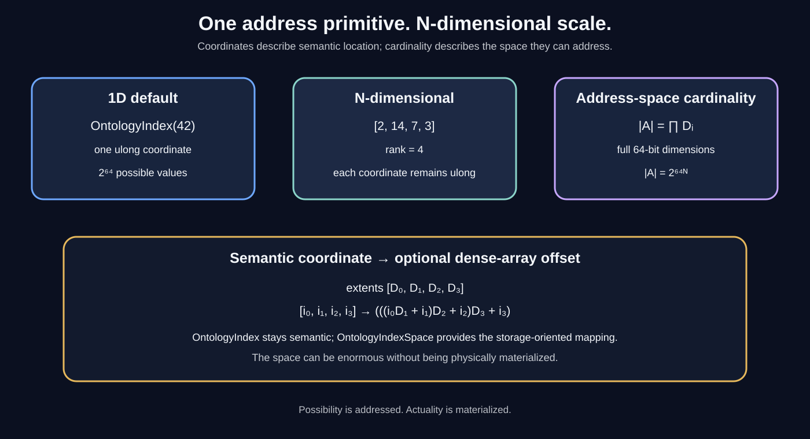

# Ontology Address-Space Mathematics

The purpose of the indexing model is not merely to make a coordinate convenient. It gives the Workshop a mathematically explicit way to describe **how much semantic address space exists** without requiring that all of that space be physically materialized.

## 1. One integer already gives us an enormous coordinate domain

OntologyIndex uses ulong coordinates.

A ulong has 64 bits, so one coordinate has:

$$
2^{64}
$$

possible values.

That is:

$$
18,446,744,073,709,551,616
$$

distinct coordinate values, from 0 through ulong.MaxValue.

## 2. N dimensions multiply the address space

For an N-dimensional coordinate where each dimension has D_i possible values, the number of possible coordinates is:

$$
|A| = \prod_{i=0}^{N-1} D_i
$$

If every dimension uses the complete 64-bit coordinate domain:

$$
D_i = 2^{64}
$$

then:

$$
|A| = (2^{64})^N = 2^{64N}
$$

This is the important scale property.

### Five dimensions

A five-dimensional full-ulong space contains:

$$
2^{320}
$$

possible coordinates.

That is approximately:

    2.135987035920914 × 10^96

### Nine dimensions

A nine-dimensional full-ulong space contains:

$$
2^{576}
$$

possible coordinates.

That is approximately:

    2.473304014731045 × 10^173

The point is not that an application should allocate that array.

The point is that **an address does not require materialization of the space it can address**.

A semantic system can therefore describe an enormous theoretical address space while storing only the definitions and coordinates that actually exist.

## 3. Real ontologies usually have bounded dimensions

Most useful spaces will not need every dimension to contain all 2^64 values.

If the dimensions have extents:

    [10, 100, 8, 32]

then the dense coordinate space contains:

$$
10 \times 100 \times 8 \times 32 = 256,000
$$

possible coordinates.

The same mathematics works whether the space has four dimensions or four hundred. The package does not impose a global layer count.

## 4. Coordinates are not automatically linear offsets

This distinction matters.

An index such as:

    [2, 14, 7, 3]

is an N-dimensional coordinate.

A dense array may additionally need a single linear offset.

For extents:

    [D0, D1, D2, D3]

the row-major offset is:

$$
(((i_0D_1 + i_1)D_2 + i_2)D_3 + i_3)
$$

More generally, the package evaluates the coordinate from left to right:

$$
offset = (((i_0D_1+i_1)D_2+i_2)\dots)D_{N-1}+i_{N-1}
$$

OntologyIndexSpace.Flatten() implements this mapping.

OntologyIndexSpace.Unflatten() reverses it.

The coordinate remains the semantic representation; the linear offset is an implementation convenience for dense storage.

## 5. The space can be larger than ulong

The coordinate components are ulong, but the **cardinality of the space is not**.

For that reason, OntologyIndexSpace.Cardinality uses BigInteger.

This distinction lets us say:

    coordinate = ulong
    space size = arbitrary-precision integer

A nine-dimensional full-ulong space therefore remains representable mathematically even though no native integer type can contain its total cardinality.

## 6. Semantic scale is not physical storage

This is one of the architectural reasons for separating ontology from repository storage.

An ontology can define:

    ontology://42/1.0.0/life/animal/fish/locomotion/swim

without requiring:

    one giant blob containing every possible fish address

A repository can materialize only the artifacts that exist:

    semantic address
          |
          +--> behavior
          +--> animation
          +--> simulation rule
          +--> documentation
          +--> remote artifact

The address space describes possibility.

The repository stores actuality.

## 7. ProtocolAI remains optional

ProtocolAI can provide a vocabulary-to-ID mapping before an address is created:

    string vocabulary
           |
           v
       ProtocolAI
           |
           v
      integer identity
           |
           v
      OntologyIndex

Ontology does not need to know whether that integer originated from ProtocolAI, a database key, a generated identifier, a hash-derived scheme, or an application-local index.

That separation is deliberate.

## 8. Why this matters to the Workshop

The Workshop is not trying to create one giant database-shaped hierarchy.

It is creating a way to make **meaning addressable at scale**.

The architecture therefore separates:

1. **semantic possibility** — the ontology and its address space;
2. **semantic identity** — the integer coordinates and qualified addresses;
3. **relationships** — how meanings connect;
4. **materialization** — the artifacts that actually exist;
5. **runtime composition** — how FSM_COS assembles the participating pieces.

That lets a developer choose five layers, nine layers, several independent ontologies, a completely different coordinate model, or no ontology at all.

> **A huge address space is useful precisely because we do not have to build the whole thing.**
